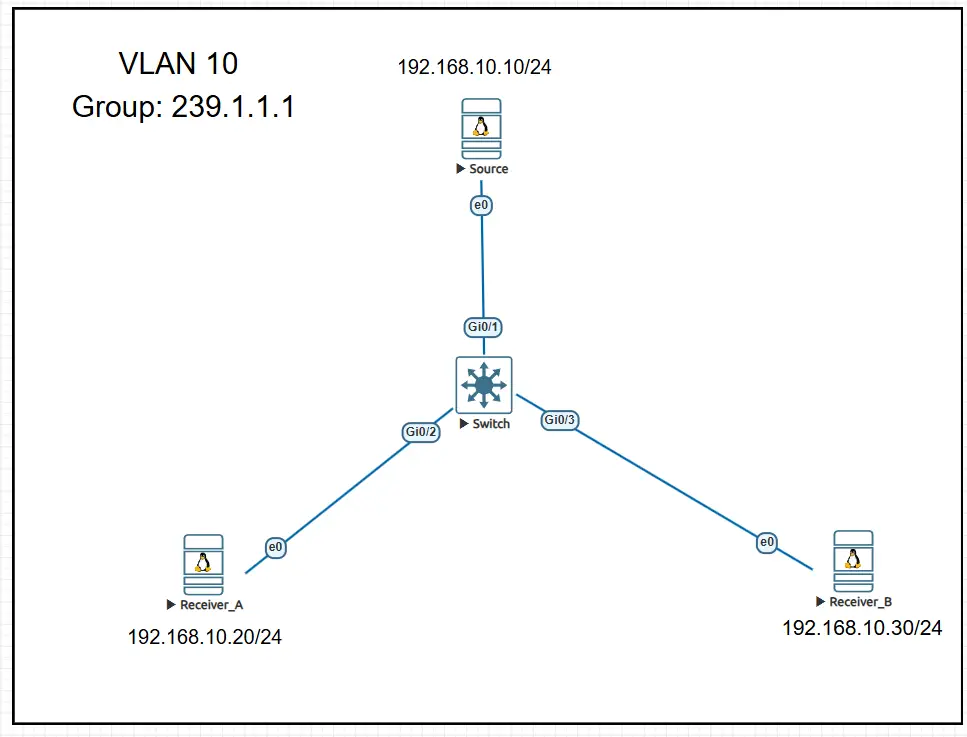
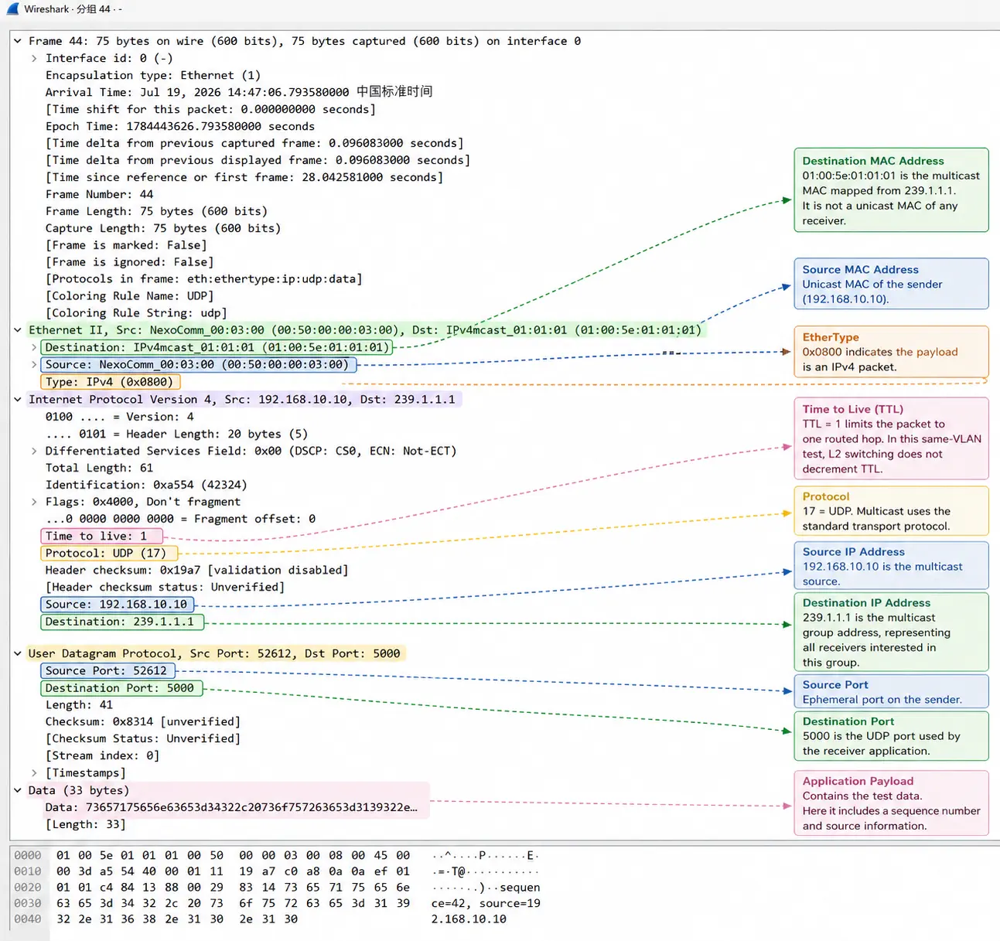

# Multicast Fundamentals: How One Packet Reaches Multiple Receivers

Multicast is often described as **one-to-many communication**, but that definition is only the starting point.

The more useful questions are:

- Why is multicast needed when unicast already works?
- Who asks for multicast traffic?
- How does the network know where receivers are?
- Where are packets replicated?
- What do IGMP, IGMP Snooping, PIM, and RPF each do?
- Why is multicast commonly used for financial market data?

This article introduces the complete multicast landscape at a high level. The protocols and mechanisms mentioned here will be explored individually in later articles.

---

## 1. Why Do We Need Multicast?

Assume that a market-data server needs to deliver the same price update to 1,000 trading servers.

The server could use unicast, broadcast, or multicast. All three models can deliver data to more than one host, but they do so in very different ways.

---

## 2. Unicast, Broadcast, and Multicast

### 2.1 Unicast: One Independent Flow per Receiver

Unicast is one-to-one communication. Every flow has a specific source and destination.

```text
                    ┌── Receiver 1
                    ├── Receiver 2
Source ─────────────├── Receiver 3
                    ├── ...
                    └── Receiver 1000
```

If the source sends the same real-time data to 1,000 receivers, it normally needs to create or maintain many independent flows and transmit repeated copies of the same payload.

As the number of receivers grows, the source may consume more:

- Egress bandwidth;
- Socket and session resources;
- Application processing capacity;
- Protocol-stack processing capacity;
- Data-copying and replication resources.

Shared network links may also carry many copies of identical data.

This does not mean that unicast is unsuitable for large systems. Modern servers, CDNs, load balancers, and distributed applications can scale unicast very effectively.

However, when a large number of receivers need the **same continuous real-time stream**, repeatedly sending identical copies may be inefficient.

---

### 2.2 Broadcast: One Copy to the Entire Layer 2 Domain
Broadcast sends traffic to every host in the same Layer 2 broadcast domain.

```text
Source
   │
   ▼
Switch
   ├── Host A
   ├── Host B
   ├── Host C
   └── Host D
```

A broadcast frame is normally forwarded out all relevant ports in the VLAN, whether the connected hosts need the data or not.

Broadcast is useful for local network functions such as ARP and DHCP Discovery, but it has several limitations:

- It normally does not cross routers;
- Every host in the broadcast domain may receive the frame;
- Uninterested hosts still need to inspect or discard the traffic;
- A large broadcast domain increases network and endpoint load;
- It is not suitable for large-scale distribution across routed networks.

---

### 2.3 Multicast: One Stream for Interested Receivers

Multicast allows a source to send one copy of the data to a **logical multicast group**.

```text
                         ┌── Receiver A
Source ─── Router ───────┤
                         └── Receiver B
```

The source sends traffic to a group address:

```text
Source → Multicast Group G
```

It does not normally need to know:

- How many receivers exist;
- Where the receivers are located;
- The receivers' unicast addresses;
- When receivers join or leave.

The network builds forwarding state according to receiver demand. Packets are copied only where downstream paths branch.

> The source sends one copy of the data, and the network replicates it where receiver paths diverge.

That is the fundamental value of multicast.

---

## 3. What Multicast Does Not Guarantee

Multicast improves distribution efficiency, but it is not a reliable transport mechanism by itself.

IP multicast commonly carries UDP traffic and normally follows a best-effort delivery model. It does not automatically guarantee that:

- Every packet will arrive;
- Packets will arrive in order;
- All receivers will experience the same latency;
- All receivers will receive data at exactly the same time;
- Service will continue without interruption during a failure;
- Lost packets will be retransmitted.

For this reason, financial market-data applications often use additional application-layer mechanisms such as:

- Sequence numbers;
- Gap detection;
- Duplicate detection;
- Packet-reordering handling;
- Retransmission channels;
- Snapshot recovery;
- Feed A/B arbitration.

Multicast makes one-to-many distribution efficient. It does not make the service lossless or deterministic.

---

## 4. Core Multicast Roles

Before discussing protocols, we need to understand the major roles in a multicast network.

### 4.1 Source

The **source** is the host or application that sends multicast traffic.

For example:

```text
Source: 192.168.10.10
Group:  239.1.1.1
Port:   UDP 5000
```

The source normally sends continuously to the group without maintaining a list of receivers.

---

### 4.2 Receiver

A **receiver** is a host or application that wants to receive traffic for a multicast group.

The application asks the operating system to join a group:

```text
Join group 239.1.1.1
```

In a Source-Specific Multicast environment, it may request traffic from a specific source:

```text
Join traffic from 10.1.1.10
to group 232.1.1.1
```

This source-and-group relationship is written as:

```text
(S,G)
```

---

### 4.3 Multicast Group

A multicast group is a **logical channel**, not a physical device.

For example:

```text
239.1.1.1
```

Multiple receivers may join the same group:

```text
Receiver A ─┐
Receiver B ─┼── Join 239.1.1.1
Receiver C ─┘
```

The source sends data to the group, and the network forwards it toward locations that contain interested receivers.

---

### 4.4 First-Hop Router

The **First-Hop Router**, or FHR, is the multicast router closest to the source.

Depending on the multicast design, it may:

- Receive traffic from the source;
- Create source-side multicast state;
- Perform RPF-related processing;
- Register the source with an RP in a PIM-SM ASM network.

---

### 4.5 Last-Hop Router

The **Last-Hop Router**, or LHR, is the multicast router closest to the receiver.

It may:

- Receive IGMP Membership Reports;
- Maintain local receiver membership;
- Send PIM Joins upstream;
- Forward multicast traffic into the receiver VLAN.

---

### 4.6 Rendezvous Point

A **Rendezvous Point**, or RP, is used in PIM Sparse Mode Any-Source Multicast.

It acts as a logical meeting point between sources and receivers.

The receiver side can initially build a shared tree toward the RP, while the source-side First-Hop Router registers the source with the RP.

The RP is mainly used for:

- Source discovery;
- Shared-tree construction;
- Connecting the source side and receiver side.

The RP does not necessarily remain permanently in the data path. A Last-Hop Router may later switch to a source-based shortest-path tree and receive traffic directly from the source side.

SSM does not need an RP for source discovery because the receiver already knows the source address.

---

## 5. Multicast Is Receiver-Driven

A source can send multicast traffic even when no receivers exist.

```text
Source ─── Send traffic to Group G
```

However, the network normally builds downstream forwarding state only when receivers express demand.

A receiver first uses IGMP:

```text
Receiver
   │
   │ IGMP Membership Report
   ▼
Last-Hop Router
```

The Last-Hop Router then uses PIM to build the multicast distribution tree upstream:

```text
Last-Hop Router
   │
   │ PIM Join
   ▼
Upstream Routers
   │
   ▼
RP or Source
```

The basic multicast model can therefore be summarized as:

> The source sends, the receiver expresses demand, and the network builds a distribution path according to that demand.

---

## 6. The Multicast Control-Plane Map

Multicast is not implemented by one protocol. Several protocols and mechanisms work together.

```text
Receiver Membership
        │
       IGMP
        │
        ▼
Last-Hop Router
        │
       PIM
        │
        ▼
Multicast Distribution Tree
        │
        ▼
Packet Replication and Forwarding
```

At Layer 2, IGMP Snooping helps the switch determine which access ports actually need the traffic.

RPF uses existing routing information to verify that multicast packets arrive from the expected upstream direction.

The major components are:

- IGMP;
- IGMP Snooping;
- PIM;
- RPF;
- The unicast routing table.

---

## 7. What Does Each Component Do?

### 7.1 IGMP: Receiver Membership

IGMP manages multicast group membership between IPv4 receivers and the local multicast router.

A receiver can use IGMP to express:

```text
I want traffic for group G.
```

With IGMPv3, it can also express source-specific interest:

```text
I want traffic from source S for group G.
```

IGMP helps determine:

- Which groups have local receivers;
- When receivers join or leave;
- Whether any active receivers remain;
- Which sources a receiver wants or does not want.

IGMP does **not** build multicast paths between routers.

---

### 7.2 IGMP Snooping: Layer 2 Forwarding Optimization

A Layer 2 switch can inspect IGMP messages passing through it. This mechanism is called **IGMP Snooping**.

The switch learns which ports connect to interested receivers and can build forwarding state such as:

```text
Group 239.1.1.1
Outgoing Ports:
- Ethernet1/1
- Ethernet1/3
```

Instead of flooding multicast traffic to every access port, the switch can forward it only toward receiver-facing ports and required multicast-router ports.

IGMP Snooping is therefore a Layer 2 optimization. It does not build multicast trees across routed networks.

---

### 7.3 PIM: Multicast Trees Between Routers

PIM stands for:

```text
Protocol Independent Multicast
```

PIM builds and maintains multicast distribution trees between routers.

It is called protocol independent because it does not require a specific unicast routing protocol. The unicast route may have been learned through:

- OSPF;
- IS-IS;
- BGP;
- Static routing;
- Connected routing.

PIM uses the existing routing information to determine the upstream direction toward a source or RP.

PIM may create:

- `(*,G)` shared-tree state;
- `(S,G)` source-specific state;
- Join and Prune state;
- Incoming and outgoing interface state.

---

### 7.4 RPF: Verifying the Upstream Direction

RPF stands for:

```text
Reverse Path Forwarding
```

When a router receives a multicast packet, it checks whether the packet arrived on the expected interface toward the source.

Conceptually, the router asks:

```text
Which interface would I use to reach the source?
```

Assume the unicast route to the source points to Interface A:

```text
Route to Source S:
via Interface A
```

The multicast packet is normally expected to arrive through Interface A.

```text
Packet arrives on Interface A
→ RPF check passes

Packet arrives on Interface B
→ RPF check may fail
→ Packet is dropped
```

RPF helps prevent multicast loops and duplicate forwarding.

This is why multicast routing depends heavily on the quality and stability of the underlying unicast routing design.

---

## 8. Control Plane and Data Plane

It is important to separate multicast control-plane functions from data-plane forwarding.

### Control Plane

The control plane creates and maintains multicast state:

- Receivers send IGMP Reports;
- Switches learn receiver-facing ports through IGMP Snooping;
- Routers establish PIM neighbors;
- Routers send PIM Join and Prune messages;
- Routers calculate RPF interfaces;
- Devices build `(*,G)` and `(S,G)` entries;
- Forwarding state is programmed into hardware.

### Data Plane

The data plane forwards and replicates packets according to that state.

For a multicast packet, a router or switch may evaluate:

- Source address;
- Group address;
- Incoming interface;
- RPF result;
- Outgoing interface list;
- Hardware replication state.

The packet is then copied onto the required outgoing interfaces.

In modern network equipment, normal packet forwarding and replication are usually performed by the ASIC or forwarding hardware rather than by the control-plane CPU.

---

## 9. Understanding `(*,G)` and `(S,G)`

### 9.1 `(*,G)`: Any Source to Group G

`(*,G)` means:

```text
Any source sending to group G
```

For example:

```text
(*, 239.1.1.1)
```

The asterisk does not mean that no source exists. It means that the state is not limited to one specific source.

`(*,G)` is commonly associated with the ASM shared tree.

---

### 9.2 `(S,G)`: A Specific Source to Group G

`(S,G)` means:

```text
A specific source S sending to group G
```

For example:

```text
(10.1.1.10, 232.1.1.1)
```

This identifies one source and one multicast group.

`(S,G)` state is used in:

- SSM;
- Source-based shortest-path trees;
- Source-specific forwarding and troubleshooting.

It is important to note that `(S,G)` is not exclusive to SSM. An ASM network may also create `(S,G)` state after switching from the shared tree to a shortest-path tree.

---

## 10. Shared Tree and Shortest-Path Tree

### Shared Tree

A shared tree is logically rooted at the RP.

```text
Source
   │
   ▼
  RP
   │
   ▼
Receiver
```

The receiver does not need to know the source in advance. It can join the group and initially build `(*,G)` state toward the RP.

This provides flexible source discovery, but it may also introduce:

- Indirect traffic paths;
- RP-related dependencies;
- More control-plane complexity;
- Additional troubleshooting steps.

---

### Shortest-Path Tree

A shortest-path tree is rooted at the source.

```text
Source
   │
   └──── RPF Path ──── Receiver
```

It normally uses `(S,G)` state.

The path is based on the routing system's reverse path toward the source. It may be more direct than the shared tree, but it still depends on:

- Unicast routing;
- RPF;
- PIM state;
- Interface availability;
- Hardware forwarding resources.

An SPT does not guarantee that traffic will never be interrupted or take a suboptimal path.

---

## 11. ASM and SSM at a Glance

### 11.1 Any-Source Multicast

ASM allows a receiver to join a group without identifying the source in advance.

```text
(*,G)
```

In a PIM-SM ASM network:

1. The receiver joins Group G;
2. The LHR sends a `(*,G)` Join toward the RP;
3. The source sends traffic to Group G;
4. The FHR registers the source with the RP;
5. The RP connects the source side and receiver side;
6. Initial traffic may traverse the shared tree;
7. The LHR may later build an `(S,G)` shortest-path tree.

ASM is useful when source discovery needs to be dynamic or when legacy applications do not support source-specific joins.

---

### 11.2 Source-Specific Multicast

SSM requires the receiver to specify both the source and the group:

```text
(S,G)
```

The standard IPv4 SSM range is:

```text
232.0.0.0/8
```

A typical SSM process is:

```text
Receiver
   │ IGMPv3 (S,G) Report
   ▼
Last-Hop Router
   │ PIM (S,G) Join
   ▼
RPF Path toward Source
   │
   ▼
Source
```

Because the source is already known, SSM does not require an RP for source discovery.

SSM can reduce:

- RP-related complexity;
- Shared-tree state;
- Source-discovery dependencies;
- Exposure to unintended sources;
- Some ASM failure modes.

SSM still depends on IGMP, PIM, RPF, unicast routing, and hardware multicast resources.

---

## 12. Why Multicast Matters in Financial Networks

Financial market-data distribution is one of the most important multicast use cases.

Typical characteristics include:

- One exchange or publisher sends the same data to many consumers;
- The publisher addresses are known;
- Data is transmitted continuously;
- UDP is commonly used;
- Latency and packet loss matter;
- Receivers subscribe to specific feeds;
- Source, group, and destination-port mappings are carefully planned.

Multicast reduces repeated traffic on shared paths, while SSM allows receivers to request a specific source and group.

For a known market-data source, SSM often provides a clearer operational model:

```text
Source IP + Group IP + UDP Port
```

This makes the traffic easier to document, restrict, monitor, and troubleshoot.

However, multicast alone does not solve market-data reliability. Sequence numbers, gap recovery, redundant feeds, and application-level processing remain essential.

---

## 13. Lab: Observing Multicast Encapsulation and Layer 2 Replication

This introductory lab focuses only on the data packet and Layer 2 replication.

It does not yet explore IGMP Querier behavior, Membership Reports, Leave processing, mrouter ports, PIM, or RP operations. Those topics will be covered later.

### 13.1 Lab Objectives

The lab verifies:

- How a source sends UDP multicast traffic;
- How the packet is encapsulated in Ethernet, IPv4, and UDP;
- How an IPv4 multicast group maps to an Ethernet multicast destination;
- How a switch replicates one incoming packet onto multiple outgoing ports;
- What happens when IGMP Snooping is disabled.

---

### 13.2 Topology

```text
                   SW1
             _______|_______
            |       |       |
         Source  Receiver A Receiver B
```



All three hosts are placed in VLAN 10.

| Device | IP address |
|---|---|
| Source | `192.168.10.10/24` |
| Receiver A | `192.168.10.20/24` |
| Receiver B | `192.168.10.30/24` |

The source sends traffic to:

```text
Group: 239.1.1.1
UDP destination port: 5000
TTL: 1
```

Because all devices are in the same VLAN, no default gateway is required for this experiment.

---

### 13.3 Configure the Hosts

Example Linux configuration:

#### Source

```bash
ip addr flush dev ens3
ip addr add 192.168.10.10/24 dev ens3
ip link set ens3 up
ip -br addr
```

#### Receiver A

```bash
ip addr flush dev ens3
ip addr add 192.168.10.20/24 dev ens3
ip link set ens3 up
ip -br addr
```

#### Receiver B

```bash
ip addr flush dev ens3
ip addr add 192.168.10.30/24 dev ens3
ip link set ens3 up
ip -br addr
```

---

### 13.4 Verify the Initial Snooping Table

On the switch:

```text
show ip igmp snooping groups
```

Before any receiver membership is learned, the output should contain no group entries.

---

### 13.5 Disable IGMP Snooping

For this phase, disable IGMP Snooping in VLAN 10:

```text
configure terminal
no ip igmp snooping vlan 10
end
```

Verify the configuration:

```text
show ip igmp snooping vlan 10
```

With snooping disabled, the switch does not use receiver membership to restrict Layer 2 multicast forwarding.

On the tested platform, multicast traffic is therefore flooded within the VLAN.

> Unknown multicast behavior can vary by vendor and platform, so production behavior should always be verified on the actual equipment.

---

### 13.6 Send Multicast Traffic

The following script is compatible with both Python 2 and Python 3:

```python
#!/usr/bin/env python

from __future__ import print_function

import socket
import struct
import time

GROUP = "239.1.1.1"
PORT = 5000
SOURCE_IP = "192.168.10.10"

sock = socket.socket(
    socket.AF_INET,
    socket.SOCK_DGRAM,
    socket.IPPROTO_UDP
)

sock.setsockopt(
    socket.IPPROTO_IP,
    socket.IP_MULTICAST_TTL,
    struct.pack("b", 1)
)

sock.setsockopt(
    socket.IPPROTO_IP,
    socket.IP_MULTICAST_IF,
    socket.inet_aton(SOURCE_IP)
)

sequence = 1

try:
    while True:
        message = "sequence={}, source={}".format(
            sequence,
            SOURCE_IP
        )

        sock.sendto(
            message.encode("ascii"),
            (GROUP, PORT)
        )

        print(
            "Sent: {} -> {}:{}".format(
                message,
                GROUP,
                PORT
            )
        )

        sequence += 1
        time.sleep(1)

except KeyboardInterrupt:
    print("\nSender stopped.")

finally:
    sock.close()
```

The source sends one packet every second.

Example payload:

```text
sequence=42, source=192.168.10.10
```

---

### 13.7 Capture and Analyze the Packet

Capture the Source-to-SW1 link and the SW1-to-Receiver links with Wireshark.



The packet contains normal protocol encapsulation:

```text
Ethernet II
→ IPv4
→ UDP
→ Application Payload
```

Example fields:

```text
Source MAC:      00:50:00:00:03:00
Destination MAC: 01:00:5e:01:01:01

Source IP:       192.168.10.10
Destination IP:  239.1.1.1
TTL:             1
Protocol:        UDP

Source Port:      Dynamic ephemeral port
Destination Port: 5000
Payload:          sequence=42, source=192.168.10.10
```

The destination IP identifies the multicast group rather than one receiver.

The destination MAC is an Ethernet multicast MAC mapped from the IPv4 multicast address. It is not the unicast MAC address of Receiver A or Receiver B.

The detailed IPv4 multicast-to-MAC mapping process will be covered in the next article.

---

### 13.8 Observe Packet Replication

The Source-to-SW1 link shows one packet with a specific sequence number.

Both receiver-facing links show packets with the same sequence number.

```text
Source sends:
sequence=42
        │
        ▼
       SW1
      /   \
     /     \
sequence=42 sequence=42
Receiver A  Receiver B
```

This proves that:

1. The source sent one packet;
2. The switch received that packet;
3. The switch created multiple outgoing copies;
4. The copies carried the same application payload.

With IGMP Snooping disabled, this replication is flooding-based rather than membership-based.

---

### 13.9 Seeing a Packet Is Not the Same as Joining a Group

A packet appearing in Wireshark does not prove that a receiver application has joined the multicast group.

These are different stages:

```text
Packet exists on the link
        ↓
NIC or capture point sees the frame
        ↓
Operating system accepts the packet
        ↓
Application has joined the group
        ↓
Application reads and processes the UDP payload
```

A capture tool may see a multicast frame even though no application is subscribed to the group.

IGMP membership and application socket behavior will be examined in a later article.

---

### 13.10 Restore IGMP Snooping

After the test, restore the switch configuration:

```text
configure terminal
ip igmp snooping vlan 10
end
```

Verify:

```text
show ip igmp snooping vlan 10
```

---

### 13.11 Lab Findings

The experiment demonstrates that:

1. Multicast uses standard Ethernet, IPv4, and UDP encapsulation.
2. The destination IP represents a logical multicast group.
3. The group address maps to an Ethernet multicast MAC address.
4. The source sends one copy of each packet.
5. The switch replicates the packet onto multiple outgoing ports.
6. With IGMP Snooping disabled, multicast traffic may be flooded within the VLAN.
7. Capturing a multicast frame does not prove that an application joined the group.
8. A TTL of 1 is sufficient inside the same VLAN because Layer 2 switching does not decrement the IPv4 TTL.

---

## 14. A Practical Multicast Troubleshooting Mindset

Although this article does not provide a complete troubleshooting procedure, it is useful to establish one principle early:

> Troubleshoot multicast from the receiver backward toward the source.

A practical high-level sequence is:

```text
Application Membership
        ↓
IGMP State
        ↓
IGMP Snooping State
        ↓
Last-Hop Router State
        ↓
PIM Join State
        ↓
RPF Interface
        ↓
Source and First-Hop Router
        ↓
Data-Plane Counters and Packet Capture
```

Multicast is stateful. Successful forwarding depends on several pieces of control-plane and data-plane information being consistent at the same time.

A working unicast ping does not automatically prove that multicast will work.

---

## 15. Key Takeaways

- Unicast creates independent flows toward individual receivers.
- Broadcast reaches the entire Layer 2 broadcast domain.
- Multicast sends one stream toward a logical group.
- The network replicates packets where downstream paths branch.
- Multicast is receiver-driven.
- IGMP manages receiver membership.
- IGMP Snooping optimizes Layer 2 forwarding.
- PIM builds multicast distribution trees between routers.
- RPF validates the expected upstream direction.
- `(*,G)` represents any source sending to Group G.
- `(S,G)` represents a specific source sending to Group G.
- ASM uses an RP for source discovery and shared-tree construction.
- SSM allows the receiver to identify the source directly.
- Multicast improves efficiency but does not guarantee reliable delivery.
- Market-data systems still require sequence tracking, recovery, and redundancy.

---

## 16. What Comes Next?

This article introduced the complete multicast map without going deeply into each protocol.

The next articles will follow this path:

```text
Multicast Fundamentals
        │
        ▼
IPv4 Multicast Addressing
        │
        ▼
Multicast MAC Mapping
        │
        ▼
IGMP
        │
        ▼
IGMP Snooping
        │
        ▼
RPF and Multicast Forwarding
        │
        ▼
PIM Sparse Mode
        │
        ▼
Rendezvous Point
        │
        ▼
Shared Tree and SPT
        │
        ▼
Source-Specific Multicast
        │
        ▼
Multicast Design and Troubleshooting
        │
        ▼
Financial Market-Data Networking
```

The next article will focus on IPv4 multicast addressing, including address ranges, scope, reserved blocks, and the relationship between multicast IP addresses and Ethernet multicast MAC addresses.


<script src="https://giscus.app/client.js"
        data-repo="Alex-Xushjie/Alex-life"
        data-repo-id="R_kgDOTBXE4w"
        data-category="General"
        data-category-id="DIC_kwDOTBXE484DAIZT"
        data-mapping="pathname"
        data-strict="0"
        data-reactions-enabled="1"
        data-emit-metadata="0"
        data-input-position="top"
        data-theme="preferred_color_scheme"
        data-lang="en"
        crossorigin="anonymous"
        async>
</script>